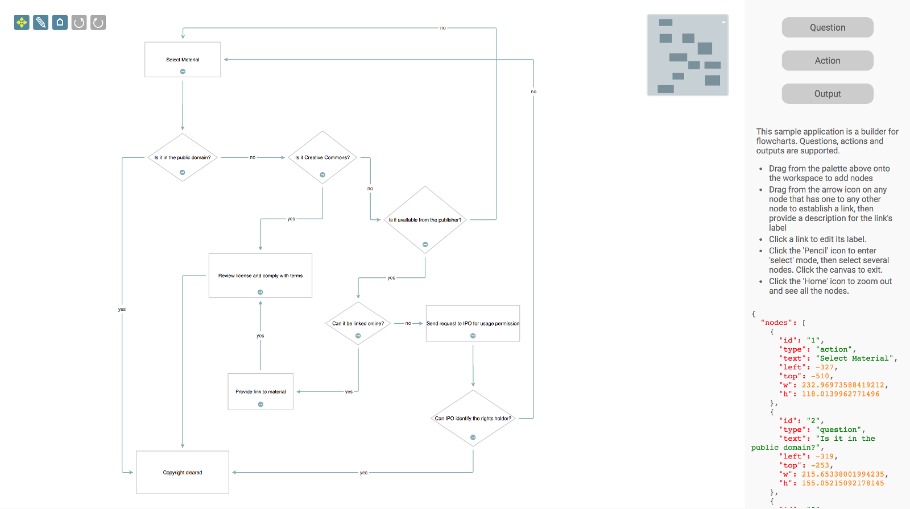

<a name="top"></a>
# Flowchart Builder (Vue 2, Typescript)

This is a port of the Flowchart Builder application that demonstrates the Toolkit's Vue 2 ES6 module based integration, in a Vue CLI 3 application. This branch - `typescript` - uses Typescript, and the `vue-class-component` and `vue-property-decorator` libraries. 



This page gives you an in-depth look at how the application is put together.

## package.json

This file was created for us by the CLI, to which we then added a few entries:

```javascript
{
    "dependencies": {
            "@jsplumbtoolkit/browser-ui-plugin-drawing-tools": "^5.12.0",
            "@jsplumbtoolkit/browser-ui-plugin-lasso": "^5.12.0",
            "@jsplumbtoolkit/browser-ui-plugin-miniview": "^5.12.0",
            "@jsplumbtoolkit/browser-ui-vue2": "^5.12.0",
            "@jsplumbtoolkit/browser-ui-vue2-drop": "^5.12.0",
            "@jsplumbtoolkit/connector-editors-orthogonal": "^5.12.0",
            "@jsplumbtoolkit/dialogs": "^5.12.0",
            "@jsplumbtoolkit/layout-force-directed": "^5.12.0",
            "core-js": "^3.6.5",
            "vue": "2.6.11",
            "vue-class-component": "7.2.6",
            "vue-property-decorator": "^9.1.2"
        },
        "devDependencies": {
            "@babel/plugin-proposal-class-properties": "^7.18.6",
            "@babel/plugin-proposal-decorators": "^7.19.6",
            "@typescript-eslint/eslint-plugin": "^5.41.0",
            "@typescript-eslint/parser": "^5.41.0",
            "@vue/cli-plugin-babel": "~4.5.13",
            "@vue/cli-plugin-typescript": "~4.5.13",
            "@vue/cli-service": "~4.5.13",
            "babel-eslint": "^10.1.0",
            "eslint": "^6.7.2",
            "eslint-plugin-vue": "^9.6.0",
            "vue-template-compiler": "2.6.11"
        }
}

```

We use `@vue/cli-plugin-typescript` to handle Typescript compilation. `vue-class-component` and `vue-property-decorator` are a couple of libraries that provide a neat way of working with Vue 2 components that fits very well with Typescript. The babel plugins listed here are required as part of the configuration of those two libraries - they add support for decorators to Babel.


[TOP](#top)

---


## Bootstrap

A CLI application is bootstrapped through `src/main.ts`. Ours looks like this:

```javascript
import Vue from 'vue'
import App from './App.vue'
import { JsPlumbToolkitVue2Plugin } from '@jsplumbtoolkit/browser-ui-vue2'

Vue.config.productionTip = false

// import plugin the new way
Vue.use(JsPlumbToolkitVue2Plugin)

new Vue({ render: h => h(App) }).$mount('#app')

```

[TOP](#top)

---

## Application

The component that acts as the entry point of the application is defined in `App.vue`, which looks like this:

```vue
<template>
  <div id="app">
    <div class="jtk-demo-main" id="jtk-demo-flowchart">


        <div id="canvas" class="jtk-demo-canvas">
          <Controls surface-id="surface"></Controls>
          <Flowchart surface-id="surface"></Flowchart>
        </div>

        <div class="jtk-demo-rhs">
          <Palette surface-id="surface"
                   selector="[data-node-type]"
                   v-bind:data-generator="dataGenerator">
          </Palette>
          <div class="description">
            <p>
              This sample application is a copy of the Flowchart Builder application, using the Toolkit's
              Vue 2 integration components and Vue CLI 3, with Typescript.
            </p>
            <ul>
              <li>Drag new nodes from the palette on the left onto whitespace to add new disconnected nodes</li>
              <li>Drag new nodes from the palette on the left onto on edge to drop a node between two existing nodes</li>
              <li>Drag from the grey border of any node to any other node to establish a link, then provide a description for the link's label</li>
              <li>Click a link to edit its label.</li>
              <li>Click the 'Pencil' icon to enter 'select' mode, then select several nodes. Click the canvas to exit.</li>
              <li>Click the 'Home' icon to zoom out and see all the nodes.</li>
            </ul>
          </div>
        </div>

    </div>

  </div>
</template>

<style>
  @import "../node_modules/@jsplumbtoolkit/browser-ui/css/jsplumbtoolkit.css";
  @import "../node_modules/@jsplumbtoolkit/dialogs-core/css/jsplumbtoolkit-dialogs.css";
  @import "../node_modules/@jsplumbtoolkit/browser-ui/css/jsplumbtoolkit-demo-support.css";
  @import "../node_modules/@jsplumbtoolkit/connector-editors/css/jsplumbtoolkit-connector-editors.css";
  @import "./assets/css/app.css";
</style>

<script lang="ts">

import { Component, Vue } from "vue-property-decorator"

import { uuid } from "@jsplumbtoolkit/core"

import Flowchart from './components/Flowchart.vue'
import Palette from './components/Palette.vue'
import Controls from './components/Controls.vue'

@Component({
  components:{
    Flowchart, Palette, Controls
  }
})

export default class AppComponent extends Vue {

    dataGenerator(el:HTMLElement) {
      return {
        type:el.getAttribute("data-node-type"),
        w:el.getAttribute("data-width"),
        h:el.getAttribute("data-height"),
        id:uuid()
      };
    }
  }

</script>

```


Points to note:

- We use the `@Component` decorator from `vue-property-editor` in this demonstration.
- The template uses 3 components that are also declared in this app - `Flowchart`, `Palette` and `Controls`. A discussion of each of these is below.


---

## Flowchart Component

This is where most of the functionality is coordinated. We'll break it up into sections and go through each one.

### Template

```xml
<template>
    <div style="width: 100%;height: 100%;position: relative;">
    <jsplumb-toolkit ref="toolkitComponent"
                     url="data/copyright.json"
                     v-bind:render-params="renderParams()"
                     v-bind:view="view()"
                     surface-id="surface"
                     v-bind:toolkit-params="toolkitParams()">

    </jsplumb-toolkit>
    <jsplumb-miniview surface-id="surface"></jsplumb-miniview>
    </div>
</template>
```

We use the `jsplumb-toolkit` component, providing several pieces of information:

- **ref="toolkitComponent"** we want to be able to retrieve this component after mounting, as we need a reference to the underlying Toolkit instance for some of our business logic
- **url="flowchart-1.json"** we provide the url for an initial dataset to load. This is of course optional.
- **v-bind:render-params="renderParams()"** These are the parameters passed to the Surface component that renders the dataset. In order to ensure we retain correct scoping of `this`, we generate these via a method on the flowchart component class (as opposed to providing them as a static object)
- **v-bind:view="view()"** This is the view passed to the Surface component that renders the dataset. The view is responsible for mapping node/edge/port types to their appearance and behaviour.
- **surface-id="surface"** We assign an ID to the surface for a couple of reasons: first, we need to nominate which surface to attach our miniview, controls and palette components to. Second, we need to access the surface for some of our app's functionality (which we will do inside the `mounted()` method of the flowchart component)
- **v-bind:toolkit-params="toolkitParams()"** These are the parameters passed to the constructor of the Toolkit instance.


### Script Block

We'll break this up into parts too.

#### Imports

```
// jsPlumb imports
import {BrowserUIVue2, getSurface, EVENT_CLICK, DEFAULT, Surface} from '@jsplumbtoolkit/browser-ui-vue2'
import { uuid, Node, Edge, Base, ObjectData } from "@jsplumbtoolkit/core"
import { AnchorLocations } from "@jsplumb/common"
import { BlankEndpoint, ArrowOverlay, Connection, LabelOverlay} from "@jsplumb/core"
import { ForceDirectedLayout } from "@jsplumbtoolkit/layout-force-directed"
import { LassoPlugin } from "@jsplumbtoolkit/browser-ui-plugin-lasso"
import { DrawingToolsPlugin } from "@jsplumbtoolkit/browser-ui-plugin-drawing-tools"
import {Dialogs, newInstance} from "@jsplumbtoolkit/dialogs"
import { newInstance as newConnectorEditor, EdgePathEditor } from "@jsplumbtoolkit/connector-editors"
import { OrthogonalConnector } from "@jsplumbtoolkit/connector-orthogonal"
// NOTE: you must do this in order for the orthogonal connector to not be thrown away when tree shaking happens.
import * as OrthogonalConnectorEditors from "@jsplumbtoolkit/connector-editors-orthogonal"
OrthogonalConnectorEditors.initialize()

// vue component imports
import {Vue, Component, Prop} from 'vue-property-decorator'

// local imports
import StartNode from './StartNode.vue'
import ActionNode from './ActionNode.vue'
import QuestionNode from './QuestionNode.vue'
import OutputNode from './OutputNode.vue'
import {
    DIALOG_CONFIRM,
    DIALOG_MESSAGE,
    DIALOG_TEXT, EDGE_TYPE_RESPONSE, NODE_TYPE_ACTION, NODE_TYPE_OUTPUT, NODE_TYPE_QUESTION,
    NODE_TYPE_SELECTABLE,
    NODE_TYPE_START, PORT_TYPE_SOURCE, PORT_TYPE_START, PORT_TYPE_TARGET
} from "./constants"
```

There are three types of imports:

##### jsPlumb imports

Various data model imports, the layout, plugins, methods to access a Surface, event names, etc. Note in particular here the code that imports and initializes the orthogonal connector editor:

```javascript
import * as OrthogonalConnectorEditors from "@jsplumbtoolkit/connector-editors-orthogonal"
OrthogonalConnectorEditors.initialize()
```

It is necessary to do this because in the current architecture, connector editors are instantiated internally by name, which is a mechanism that evades any tree shaking, and consequently, without this call, the connector editor is omitted from the final bundle.

##### Vue imports

We use the `vue-class-component` and `vue-property-decorator` libraries in this demonstration.

##### Local imports

We import each of the components used to render the node types, and various constants used to identify node/port/edge types.


#### Component definition

The flowchart is declared as a class with the `@Component` decorator. Here we show the basic outline of the class; below we'll provide the body of each method and discuss each one.

```javascript
@Component
export default class Flowchart extends Vue {

    @Prop() surfaceId: string
    toolkit:BrowserUIVue2
    surface:Surface
    dialogs:Dialogs
    edgeEditor:EdgePathEditor
    
    toolkitParams() { ... }
    
    renderParams() { ... }
    
    view() { ... }
    
    showEdgeEditDialog() { ... }
    
    editNode() { ... }
    
    maybeDelete() { ... }
    
    mounted() { ... }
}
```

The Flowchart component declares a `surfaceId` prop. This is an arbitrary value but it is required because Surfaces are created asynchronously. Any code that wishes to access a Surface has to use this asynchronous method: 

```javascript
getSurface(surfaceId:string, (s:Surface)=>any)
```

##### `mounted()`

We'll discuss this method first.

```javascript
mounted() {

        // instantiate the dialogs to use for various user facing operations
        this.dialogs = newInstance({
            dialogs: {
                [DIALOG_TEXT]: {
                    template:'<input type="text" size="50" jtk-focus jtk-att="text" value="${text}" jtk-commit="true"/>',
                    title:'Enter Text',
                    cancelable:true
                },
                [DIALOG_CONFIRM]: {
                    template:'${msg}',
                    title:'Please Confirm',
                    cancelable:true
                },
                [DIALOG_MESSAGE]: {
                    template:'${msg}',
                    title:"Message",
                    cancelable:false
                }
            }
        });

        // get a ref to the toolkit component and store the Toolkit for use in various places
        const t = this.$refs.toolkitComponent;
        this.toolkit = (t as any).toolkit;

        // load the surface via the async `getSurface` method, then stash it on the class and
        // create a new edge path editor that is tied to it.
        getSurface(this.surfaceId, (s:Surface) => {
            this.surface = s
            this.edgeEditor = newConnectorEditor(s)
        });

    }
```

Here, we instantiate a set of dialogs for the demo to use for various operations such as editing the label of a node, setting the label for an edge, confirming deletion, etc. Dialogs is a Toolkit package that was created for the purposes of having something to use in our demonstrations and there's no specific requirement for your code to use them. But you are welcome to, if you wish!

In the `mounted()` method we also access the `toolkitComponent` ref, from which we get a reference to the underlying Toolkit instance.  Lastly, we retrieve the created Surface, store a reference to it, and create an edge editor.

##### `toolkitParams()`

This method returns constructor parameters for the underlying Toolkit instance. In this demonstration we provide a `nodeFactory`, `edgeFactory` and `beforeStartConnect` method, the purpose of each of which is discussed in the comments inside the code.

The return value of this method is passed as a prop to the Toolkit component that the template for the Flowchart component uses. We implement this a a method with a return value rather than a class member of the Flowchart class in order to avoid any problems with references to `this`. 

```javascript
toolkitParams () {
        return {
            // the node factory is invoked when the user drags a new node onto the canvas. it is responsible for preparing
            // a suitable data payload for the new node. The node factory operates via a callback - if you don't wish to
            // proceed, you simply dont call the callback.
            //
            // you can also invoke the nodeFactory by calling `addFactoryNode` on a toolkit instance - see docs for more information.
            //
            nodeFactory:((type:string, data:ObjectData, callback:(o:ObjectData) => any) => {
                this.dialogs.show({
                    id: DIALOG_TEXT,
                    title: "Enter " + type + " name:",
                    onOK: (d:Record<string, any>) => {
                        data.text = d.text;
                        // if the user entered a name...
                        if (data.text) {
                        // and it was at least 2 chars
                        if (data.text.length >= 2) {
                            // set an id and continue.
                            data.id = uuid()
                            callback(data)
                        }
                        else
                            // else advise the user.
                            alert(type + " names must be at least 2 characters!");
                        }
                        // else...do not proceed.
                    }
                })
            }),
            //
            // factory method to create a new dataset when the user drags a new edge
            //
            edgeFactory:((type:string, data:ObjectData, continueCallback:(o:ObjectData) => any, abortCallback:() => any) => {
                this.showEdgeEditDialog(data, continueCallback, abortCallback)
                return true
            }),
            //
            // interceptor that is called before the user drags a new edge. returning false aborts the drag,
            //
            beforeStartConnect:(node:Node) => {
                // limit edges from start node to 1. if any other type of node, return
                return (node.data.type === "start" && node.getEdges().length > 0) ? false : { label:"..." };
            }
        }
    }
```

##### `renderParams()`

These are the parameters that control the behaviour and appearance of the Surface, such things as what layout to use, what Surface level events to respond to, what plugins to use, how the magnetizer should behave, what grid (if any) to impose, etc. As with `toolkitParams()` this is implemented as a method, rather than a class member.

```javascript
renderParams() {
        return {
            layout:{
                type: ForceDirectedLayout.type
            },
            events:{
                modeChanged:(mode:string) => {
                    let controls = document.querySelector(".controls")
                    if (controls != null) {
                        this.surface.removeClass(controls.querySelectorAll("[mode]"), "selected-mode");
                        this.surface.addClass(controls.querySelectorAll("[mode='" + mode + "']"), "selected-mode");
                    }
                },
                canvasClick:() => {
                    this.toolkit.clearSelection()
                    this.edgeEditor.stopEditing()
                }
            },
            consumeRightClick: false,
            dragOptions: {
                filter: ".jtk-draw-handle, .node-action, .node-action i"
            },
            zoomToFit:true,
            plugins: [
                DrawingToolsPlugin.type,
                {
                    type:LassoPlugin.type,
                    options:{
                        invert:true
                    }
                }
            ],
            grid:{
                size:{
                    w:20,
                    h:20
                }
            },
            magnetize:{
                afterDrag:true
            }
        }
    }
```

##### `view()`

The view provides a mapping of node/edge/port types to their representation and behaviour.

```javascript

    view() {
        return {
            // four concrete node types, each mapped to a vue component. the `selectable` node type
            // is "abstract", ie. it has no mapping to a component and acts only to provide some common
            // functionality for action, output and question nodes.
            nodes: {
                [NODE_TYPE_START]: {
                    component:StartNode
                },
                [NODE_TYPE_SELECTABLE]: {
                    events: {
                        tap: (params:{toolkit:BrowserUIVue2, obj:Base}) => {
                            params.toolkit.toggleSelection(params.obj)
                        }
                    }
                },
                [NODE_TYPE_QUESTION]: {
                    parent: NODE_TYPE_SELECTABLE,
                    component:QuestionNode
                },
                [NODE_TYPE_ACTION]: {
                    parent: NODE_TYPE_SELECTABLE,
                    component:ActionNode
                },
                [NODE_TYPE_OUTPUT]:{
                    parent:NODE_TYPE_SELECTABLE,
                    component:OutputNode
                }
            },
            // There are two edge types defined - 'default' and 'response', which has `default` as its parent.
            edges: {
                [DEFAULT]: {
                    anchor:AnchorLocations.AutoDefault,
                    endpoint:BlankEndpoint.type,
                    connector: {type:OrthogonalConnector.type, options:{ cornerRadius: 5 } },
                    paintStyle: { strokeWidth: 2, stroke: "rgb(132, 172, 179)", outlineWidth: 3, outlineStroke: "transparent" },	//	paint style for this edge type.
                    hoverPaintStyle: { strokeWidth: 2, stroke: "rgb(67,67,67)" }, // hover paint style for this edge type.
                    events: {
                        [EVENT_CLICK]:(p:{edge:Edge}) => {
                            this.edgeEditor.startEditing(p.edge, {
                                deleteButton:true,
                                onMaybeDelete:(edge:Edge, connection:Connection, doDelete:(data:Record<string, any>) => any) => {
                                    this.dialogs.show({
                                        id: DIALOG_CONFIRM,
                                        data: {
                                            msg: "Delete Edge"
                                        },
                                        onOK: doDelete
                                    });
                                }
                            });
                        }
                    },
                    overlays: [
                        { type:ArrowOverlay.type, options:{ location: 1, width: 10, length: 10 } }
                    ]
                },
                // `response` edge has a label on it, that can be edited via click.
                [EDGE_TYPE_RESPONSE]:{
                    parent:DEFAULT,
                    overlays:[
                        {
                            type: LabelOverlay.type,
                            options: {
                                label: "${label}",
                                events: {
                                    [EVENT_CLICK]: (p:{edge:Edge}) => {
                                        this.showEdgeEditDialog(p.edge.data, (data:ObjectData) => {
                                            this.toolkit.updateEdge(p.edge, data);
                                        }, () => null)
                                    }
                                }
                            }
                        }
                    ]
                }
            },
            ports: {
                [PORT_TYPE_START]: {
                    edgeType: DEFAULT
                },
                [PORT_TYPE_SOURCE]: {
                    maxConnections: -1,
                    edgeType: EDGE_TYPE_RESPONSE
                },
                [PORT_TYPE_TARGET]: {
                    maxConnections: -1,
                    isTarget: true
                }
            }
        }
    }
```

##### `showEdgeEditDialog()`

Called when the user clicks an edge label, and when a new edge is dragged. 

```javascript
showEdgeEditDialog(data:ObjectData, continueFunction:(o:ObjectData) => any, abortFunction:() => any) {
        this.dialogs.show({
            id: DIALOG_TEXT,
            data: {
                text: data.label || ""
            },
            onOK: function (data) {
                continueFunction({label:data.text || ""})
            },
            onCancel:abortFunction
        });
    }
```

##### `editNode(...)`

Used to edit the label of some node.

```javascript
editNode(node:Node) {
    this.dialogs.show({
        id: DIALOG_TEXT,
        data: node.data,
        title: "Edit " + node.data.type + " name",
        onOK: (data) => {
            if (data.text && data.text.length > 2) {
                // if name is at least 2 chars long, update the underlying data and
                // update the UI.
                this.toolkit.updateNode(node, data);
            }
        }
    });
}
```

##### `maybeDelete(...)`

Prompts the user to see if they want to confirm deletion of the node, and deletes it if they confirm.

```javascript

    maybeDelete(node:Node) {
        this.dialogs.show({
            id: DIALOG_CONFIRM,
            data: {
                msg: "Delete '" + node.data.text + "'"
            },
            onOK:() => {
                this.toolkit.removeNode(node);
            }
        });
    }
```


---

## Node Components

Each of the four node types is rendered with a specific Vue component. With the exception of the `StartNode` component, they each include the `BaseEditableNode` mixin, whose definition is:

```
<script lang="ts">

   import { BaseNodeComponent } from '@jsplumbtoolkit/browser-ui-vue2'
   import { consume } from "@jsplumbtoolkit/browser-ui"

    export default {
        mixins:[ BaseNodeComponent ],
        methods:{
            edit:function(event:MouseEvent) {
                consume(event);
                this.$parent.$parent.editNode(this.getNode());
            },
            maybeDelete:function(event) {
                consume(event);
                this.$parent.$parent.maybeDelete(this.getNode());
            }
        }
    }

</script>

```

It offers 2 common methods - to handle editing of a node's label, and to handle a node's deletion.
 
 
### StartNode

```xml
<template>
    <div v-bind:style="{left:obj.left + 'px', top:obj.top + 'px', width:obj.w + 'px', height:obj.h + 'px'}" class="flowchart-object flowchart-start">
        <svg :width="obj.w" :height="obj.h">
            <ellipse :cx="obj.w/2" :cy="obj.h/2" :rx="(obj.w/2) - 10" :ry="(obj.h/2) - 10" class="inner"/>
        </svg>
        <span>{{obj.text}}</span>
        <div class="drag-start connect" data-jtk-source="true" data-jtk-port-type="start"></div>
    </div>
</template>

<script lang="ts">
    export default { }
</script>

```

### ActionNode

```xml
<template>
    <div v-bind:style="{left:obj.left + 'px', top:obj.top + 'px', width:obj.w + 'px', height:obj.h + 'px'}" class="flowchart-object flowchart-action" data-jtk-target="true">
        <svg :width="obj.w" :height="obj.h">
            <rect x="10" y="10" :width="obj.w-20" :height="obj.h-20" class="inner" rx="5" ry="5"/>
        </svg>

        <span>{{obj.text}}</span>

        <div class="node-edit node-action" v-on:click="edit"></div>
        <div class="node-delete node-action delete" v-on:click="maybeDelete"></div>
        <div class="drag-start connect" data-jtk-source="true" data-jtk-port-type="source"></div>
    </div>
</template>

<script lang="ts">
    import BaseEditableNode from './BaseEditableNode.vue'
    export default {
        mixins:[BaseEditableNode]
    }
</script>

```

#### OutputNode

```xml
<template>
    <div v-bind:style="{left:obj.left + 'px', top:obj.top + 'px', width:obj.w + 'px', height:obj.h + 'px'}" class="flowchart-object flowchart-output" data-jtk-target="true">
        <svg :width="obj.w" :height="obj.h">
            <rect x="0" y="0" :width="obj.w" :height="obj.h" rx="5" ry="5"/>
        </svg>
        <span>{{obj.text}}</span>
        <div class="node-edit node-action" v-on:click="edit"></div>
        <div class="node-delete node-action delete" v-on:click="maybeDelete"></div>
    </div>
</template>

<script lang="ts">
    import BaseEditableNode from './BaseEditableNode.vue'
    export default {
        mixins:[BaseEditableNode]
    }
</script>


```

#### QuestionNode

```xml
<template>
    <div v-bind:style="{left:obj.left + 'px', top:obj.top + 'px', width:obj.w + 'px', height:obj.h + 'px'}" class="flowchart-object flowchart-action" data-jtk-target="true">
        <svg :width="obj.w" :height="obj.h" stroke-linejoin="round">
            <path :d="'M ' + (obj.w/2) + ' 10 L ' + (obj.w-10) + ' ' + (obj.h/2) + ' L ' + (obj.w/2) + ' ' + (obj.h-10) + ' L 10 ' + (obj.h/2) + ' Z'" class="inner"/>
        </svg>
        <span>{{obj.text}}</span>
        <div class="node-edit node-action" v-on:click="edit"></div>
        <div class="node-delete node-action delete" v-on:click="maybeDelete"></div>
        <div class="drag-start connect" data-jtk-source="true" data-jtk-port-type="source"></div>
    </div>
</template>

<script lang="ts">
    import BaseEditableNode from './BaseEditableNode.vue'
    export default {
        mixins:[BaseEditableNode]
    }
</script>

```


---

## Dragging New Nodes

In this demonstration, new nodes can be dragged on to whitespace in the canvas, to create new, unconnected, nodes. They can also be dragged onto an existing edge, in which case the new node is injected in between the two nodes at either end of the edge on which the new node was dropped. Both of these capabilities are provided by the `SurfaceDrop` mixin from the Toolkit's Vue2 integration.

We declare a `Palette` component in the app's template:

```xml
<Palette surface-id="surface"
     selector="[data-node-type]"
     v-bind:data-generator="dataGenerator"
</Palette>
```

`Palette` is a component declared in this application, which uses the `SurfaceDrop` mixin from the Toolkit's Vue integration:

```javascript
<template>
    <div class="sidebar node-palette">
        <div class="sidebar-item" :data-node-type="entry.type" title="Drag to add new" v-for="entry in data" :key="entry.type" :data-width="entry.w" :data-height="entry.h">
            <i :class="entry.icon"></i>{{entry.label}}
        </div>
    </div>
</template>

<script lang="ts">


    import { SurfaceDrop } from '@jsplumbtoolkit/browser-ui-vue2-drop'

    export default {
        mixins:[ SurfaceDrop ],
        data:function() {
            return {
                data:[
                    { icon:"icon-tablet", label:"Question", type:"question", w:240, h:220 },
                    { icon:"icon-eye-open", label:"Action", type:"action", w:240, h:160 },
                    { type:"output", icon:"icon-eye-open", label:"Output", w:240, h:160 }
                ]
            };
        }
    }

</script>

```

The `SurfaceDrop` mixin expects any concrete class it has been attached to to expose a `selector` property, which we pass to `Palette` as a prop. Its value in this case is `[data-node-type]`; in the template for `Palette` we write out each entry's `type` as the value of its `data-node-type` attribute.


[TOP](#top)

---

## Controls Component

The buttons in the top left of the screen are handled by the component defined in `Controls.vue`. Here's the full code for the component; a discussion follows below.

```
<template>
    <div class="controls" ref="container">
        <i class="fa fa-arrows selected-mode" mode="pan" title="Pan Mode" v-on:click="panMode()"></i>
        <i class="fa fa-pencil" mode="select" title="Select Mode" v-on:click="selectMode()"></i>
        <i class="fa fa-home" reset title="Zoom To Fit" v-on:click="zoomToFit()"></i>
        <i class="fa fa-undo" undo title="Undo last action" v-on:click="undo()"></i>
        <i class="fa fa-repeat" redo title="Redo last action" v-on:click="redo()"></i>
        <i class="fa fa-times" title="Clear" v-on:click="clear()"></i>
    </div>
</template>

<script lang="ts">

    import { Vue, Component, Prop} from "vue-property-decorator"

    import { getSurface, Surface, SurfaceMode } from "@jsplumbtoolkit/browser-ui-vue2";
    import { EVENT_CANVAS_CLICK } from "@jsplumbtoolkit/browser-ui"
    import { EVENT_UNDOREDO_UPDATE } from "@jsplumbtoolkit/core"

    @Component
export default class ControlsComponent extends Vue {

    container:Element

    // a wrapper around getSurface, which expects a callback, as the surface may or may not have been
    // initialised when calls are made to it.
    _getSurface(cb:(s:Surface) => any) {
        getSurface(this.surfaceId, cb)
    }

    @Prop() surfaceId:string

    panMode() {
        this._getSurface((s) => s.setMode(SurfaceMode.PAN))
    }

    selectMode() {
        this._getSurface((s) => s.setMode(SurfaceMode.SELECT))
    }

    zoomToFit() {
        this._getSurface((s) => s.zoomToFit());
    }

    undo() {
        this._getSurface((s) => s.toolkitInstance.undo())
    }

    redo() {
        this._getSurface((s) => s.toolkitInstance.redo())
    }

    clear() {
        this._getSurface((s) => {
            const t = s.toolkitInstance;
            if (t.getNodeCount() === 0 || confirm("Clear canvas?")) {
                t.clear();
            }
        })
    }

    mounted() {

        this.container = this.$refs.container as any;
        this._getSurface((surface) => {

            surface.toolkitInstance.bind(EVENT_UNDOREDO_UPDATE, (state) => {
                this.container.setAttribute("can-undo", state.undoCount > 0 ? "true" : "false")
                this.container.setAttribute("can-redo", state.redoCount > 0 ? "true" : "false")
            })

            surface.bind(EVENT_CANVAS_CLICK, () => {
                surface.toolkitInstance.clearSelection();
            });
        });
    }
}

</script>


```

#### Referencing the component

The Controls component is created by the template in `App.vue`:

```html
<div id="canvas" class="jtk-demo-canvas">
  <Controls surface-id="surface"></Controls>
  <Flowchart surface-id="surface"></Flowchart>
</div>
```

We pass the same value for `surface-id` as we pass to the Flowchart component. Each component uses the underlying Toolkit's Vue2 service to access the Surface with this id. Note we pass the value in "kebab case" but the actual property is in camel case. 

#### Mounting the component

The component's `mounted` function does three things:

- Sets the component's `container` property. This is the DOM element hosting the component.
- Binds an event listener to the Toolkit's `EVENT_UNDOREDO_UPDATE` event, which updates the UI accordingly. 
- Binds an event listener to the `canvasClick` event to clear the current selection whenever a user clicks on whitespace in the canvas.

#### Behaviour

Each button is mapped to a method specified in the component's exports.  Note, in these methods, the use of the `_getSurface(..)` helper method to access the Surface. This method simply abstracts out the `surfaceId` from each of the individual handlers, and under the hood it accesses the `getSurface` method of the Toolkit's Vue 2 integration.

#### Pan Mode

Puts the Surface into "pan" mode (the lasso is disabled)

```javascript
panMode:function() {
    this._getSurface((s) => s.setMode(SurfaceMode.PAN))
}
```

#### Select Mode

Puts the Surface into "select" mode (the lasso is enabled)

```javascript
selectMode:function() {
    this._getSurface((s) => s.setMode(SurfaceMode.SELECT))
}
```

#### Zoom the contents to fit the viewport

This will adjust the zoom and pan so that the content is centered and zoomed to fit.

```javascript
zoomToFit:function() {
    this._getSurface((s) => s.zoomToFit())
}
```

#### Undo the last action

We call the `undo()` method of the underlying Toolkit instance:

```javascript
undo:function() {
    this._getSurface((s) => s.toolkitInstance.undo())
}
```

#### Redo the last action

We call the `redo()` method of the underlying Toolkit instance:

```javascript
redo:function() {
    this._getSurface((s) => s.toolkitInstance.redo())
}
```

#### Clear the canvas

To clear the canvas we call the `clear` method of the underlying Toolkit. Note that we call `clear()` on the Toolkit even if there are no nodes in the dataset, which may seem odd, but we do this because then a few internal events are fired which will restore the canvas to the state the user expects.

```javascript
clear: function() {
    this._getSurface((s) => {
        const t = s.toolkitInstance;
        if (t.getNodeCount() === 0 || confirm("Clear canvas?")) {
            t.clear();
        }
    })
}
```


[TOP](#top)


